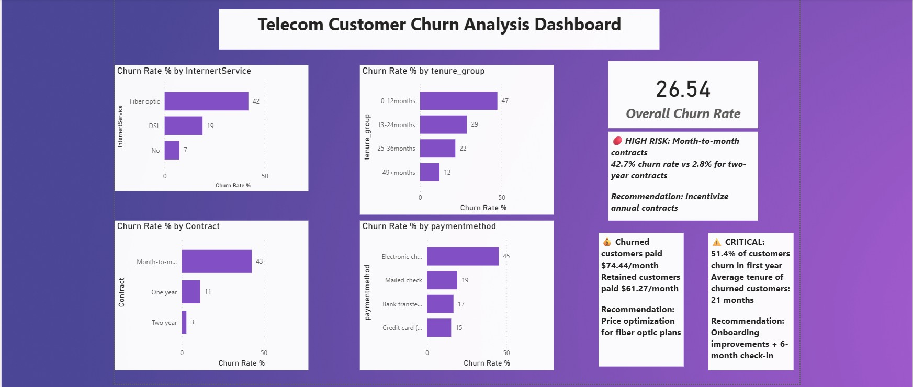

# Telecom Customer Churn Analysis

## Overview
Analyzed customer churn patterns for a telecom company 
using PostgreSQL and Power BI to identify high-risk 
customer segments and provide retention strategies.

## Dashboard Preview

## Key Findings
- 26.54% overall churn rate
- Month-to-month contracts: 42.71% churn (highest risk)
- Fiber optic users: 41.89% churn
- New customers (0-12 months): 51.44% churn (critical)
- Churned customers paid $74.44/month vs $61.27 retained
- Bank transfer auto-pay: 13.98% churn (lowest risk)

## Business Recommendations
1. Incentivize annual contracts
2. Improve fiber optic service quality
3. First-year onboarding program
4. Promote auto-payment methods

## Tools Used
- PostgreSQL + pgAdmin
- Power BI Desktop

## Files
- query1-6.sql → 6 SQL analysis queries
- query1-6.png → Query result screenshots
- Telecom_Churn_Analysis.pbix → Power BI dashboard
- Telecom_Churn_Analysis.pdf → PDF export
